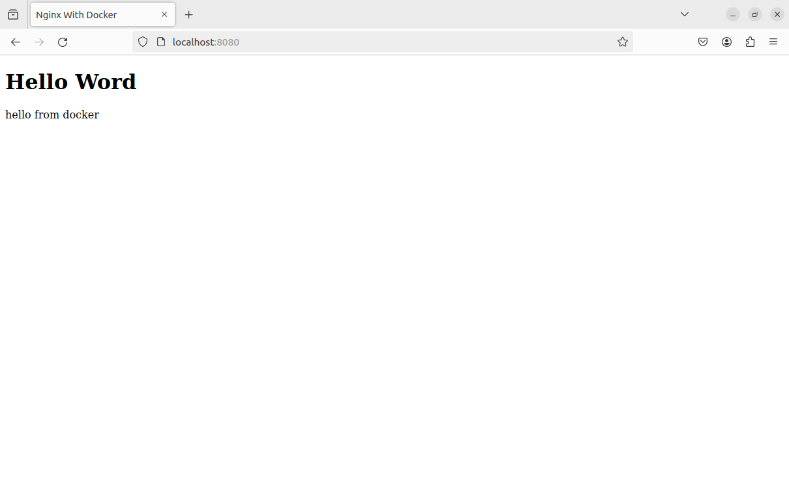
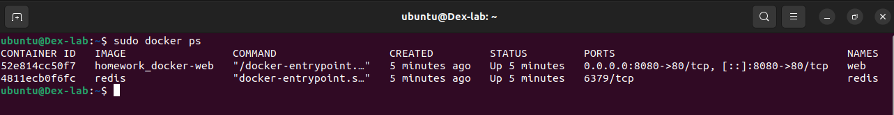
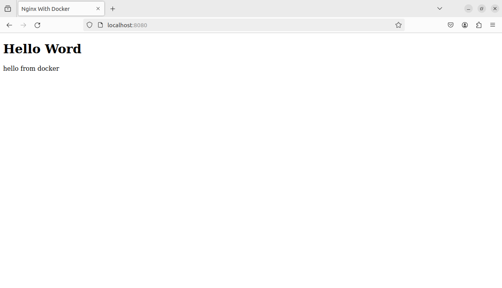

# Docker Homework

## Task 1:

- [Dockerfile](./web/Dockerfile)
- localhost:8080 screenshot:
  

## Task 2:

- [docker-compose.yml](docker-compose.yml) file
- `docker ps` screenshot
  
- localhost:8080 screenshot:
  
