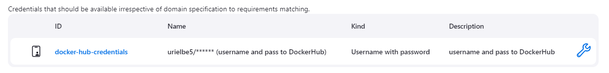
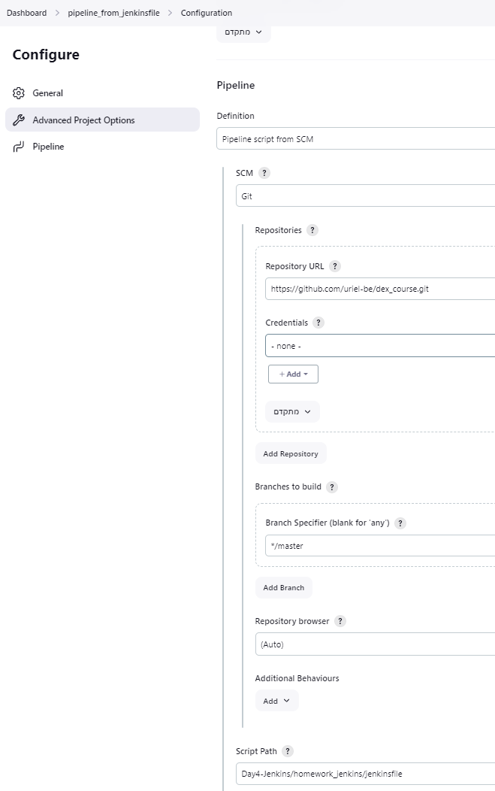
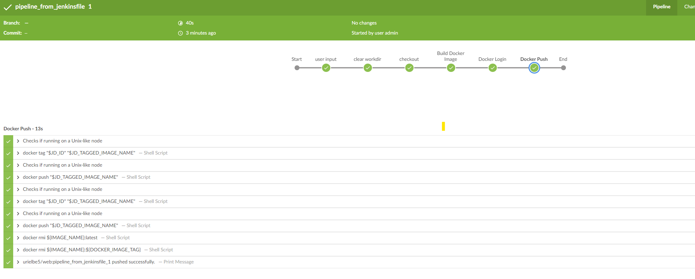
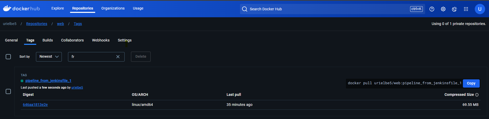

# Jenkins Homework

## Prerequisites

1. I run a Dockerized Jenkins environment using this [Dockerfile](../Jenkins_Master/Dockerfile).
2. I installed the "Docker" and "Docker Pipeline" plugins in Jenkins:  
   
3. I created new credentials with DockerHub login details:  
   
4. I created a new pipeline and named it: `pipeline_from_jenkinsfile`.
5. I wrote the following [Jenkinsfile](jenkinsfile) with the pipeline stages as listed below:
   1. **User input** - Get settings from the user about the Docker image.
   2. **Clear workdir** - Delete everything from `$WORKSPACE`.
   3. **Checkout** - Clone the project from the Git repository.
   4. **Build Docker Image** - Build the Docker image.
   5. **Docker Login** - Attempt to log in to the registry using credentials.
   6. **Docker Push** - Push the Docker images to DockerHub with the following tags:
      1. latest
      2. pipeline*from_jenkinsfile*`${env.BUILD_NUMBER}`
6. I configured the pipeline to read it from GitHub.
   

## Deliverables

1. Screenshot of the successful Jenkins job:  
   
2. Docker Hub link showing the uploaded Docker image:
   1. [urielbe5/web:pipeline_from_jenkinsfile_1](https://hub.docker.com/layers/urielbe5/web/pipeline_from_jenkinsfile_1/images/sha256-646aa1813e2eceeff7e29e6c1a133993d85fa593a39691f0210471f5d693080a?context=repo)
   2. [Repository](https://hub.docker.com/repository/docker/urielbe5/web/general)
   3. 
