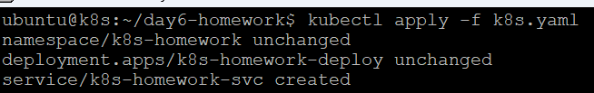
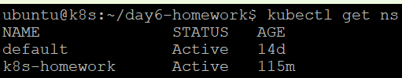
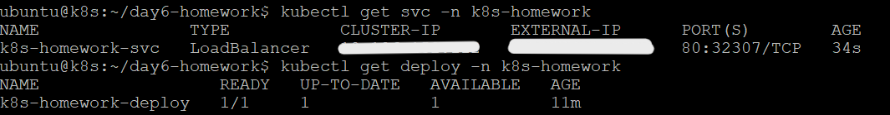
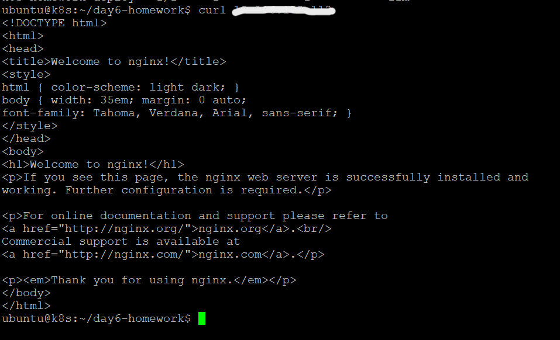

# K8s Homework

1. Create a [k8s-homework.yaml](k8s-homework.yaml) file with the configuration for:
   - Namespace
   - Deployment
   - Service
2. Execute `kubectl apply -f k8s.yaml` in the terminal.
   - The result of this command should look like: 
3. Verify that the `k8s-homework` namespace, `k8s-homework-deploy` deployment, and `k8s-homework-svc` service have been created using the following commands:

   - `kubectl get ns`
   - `kubectl get svc -n k8s-homework`
   - `kubectl get deploy -n k8s-homework`

   
   

4. Send a curl request to check if the service is exposing the Nginx application:
   - Command: `curl <External-IP>`
   - Expected result: 
