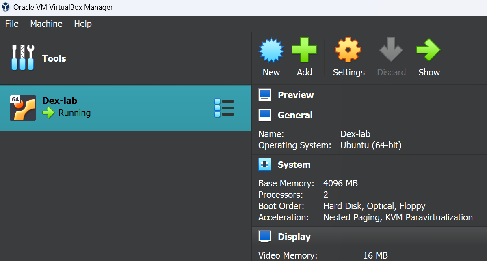
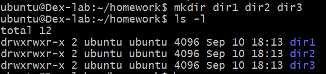
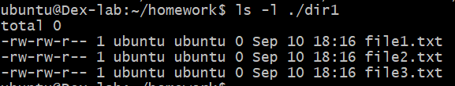
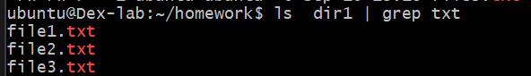
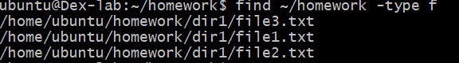
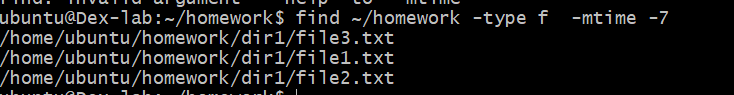

# Day 1 -Homework

## Part 1 - VirtualBox & Ubuntu Installation

### Answer 1+2+3



## Part 2 - Linux Directory And File Creation

### Answer 1-

- bash commands:

  ```bash
  cd homework/
  mkdir dir1 dir2 dir3
  ls -l
  ```

  output:
  

- bash commands:

  ```bash
  touch dir1/file1.txt dir1/file2.txt dir1/file3.txt

  #print results
  ls -l ./dir1
  ```

  output:
  

### Answer 2-

bash commands:

```bash
echo "some text" > dir1/file1.txt

#print results
 cat dir1/file1.txt
```

output:


## Part 3 - Using grep and find Commands

### Answer 1-

bash commands:

```bash
ls dir1 | grep txt
```

output:


### Answer 2-

- bash commands:

  ```bash
  find ~/homework -type f
  ```

  output:
  

- bash commands:

  ```bash
    find ~/homework -type f  -mtime -7
  ```

  output:
  
